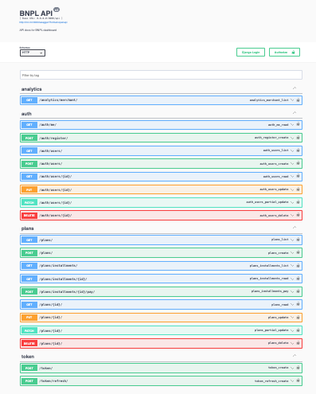

# 🏦 BNPL Backend – Buy Now, Pay Later Platform

A full-featured backend system for managing Buy Now, Pay Later (BNPL) payment plans using Django, DRF, Celery,
PostgreSQL, Redis, and Docker.

---

## ✅ Features

- Merchant & Customer roles with role-based access
- Create payment plans with automatic installment splitting
- Simulate installment payments
- Auto-mark plan status as completed when fully paid
- Overdue detection and simulated email reminders via Celery
- Merchant dashboard for revenue, overdue counts, and success rate
- Dockerized and production-ready

---

## 📁 Project Structure

```bash
bnpl_backend/
├── apps/
│   ├── accounts/        # Auth and user roles
│   ├── plans/           # PaymentPlan & Installments logic
│   ├── notifications/   # Celery tasks
│   └── analytics/       # Revenue dashboard
├── bnpl_backend_project/  # Django project settings
├── config/
│   ├── .env.example
│   ├── Dockerfile.config
│   └── gunicorn.conf.py
├── docker-compose.yml
├── Dockerfile
├── Makefile
├── requirements.txt
├── requirements-dev.txt
├── .env
└── manage.py
```

## ⚙️ Requirements

Docker
Docker Compose
Make (optional, for development convenience)

## 🚀 Getting Started

1. Clone Repo
```bash
git clone https://github.com/YOUR_USER/bnpl_backend.git
cd bnpl_backend
````

1. Configure Environment
   cp config/.env.example .env
   Edit `.env` with your settings:

DEBUG=True
SECRET_KEY=your-django-secret
POSTGRES_DB=bnpl_db
POSTGRES_USER=bnpl_user
POSTGRES_PASSWORD=bnpl_pass

1. Build & Run (Docker)
```bash
docker-compose up --build
````
Visit:

http://localhost:8000
Swagger docs: http://localhost:8000/api/docs/




1. Run DB Migrations
```bash
docker-compose exec web python manage.py migrate
docker-compose exec web python manage.py createsuperuser
````

1. Optional: Use Makefile Commands
```bash
make up # Start app
make down # Stop
make build # Build images
make logs # Tail logs
make test # Run tests
````

## 🔗 API Endpoints
```bash
-- Method	Endpoint	                                   Description
User_Authentication:
POST	 /auth/register/	                         Register user (merchant/customer).
POST	 /token/	                                 Login → Get JWT access/refresh tokens.
GET	     /auth/me/	                                 Fetch user profile.
Payment_Plans:
POST	 /api/plans/	                             Create BNPL plan (merchant only).
GET	     /api/plans/	                             List user/merchant plans.
GET	     /api/plans/{id}/	                         Get plan details.
GET      /api/plans/installments/	                 List all installments(See upcoming payments).
GET      /api/plans/{id}/installments/	             List installments for a plan.
POST	 /api/plans/installments/{id}/pay/	         Pay a pending installment(Simulate payment).
Analytics (Merchant Dashboard):
GET	     /api/plans/analytics/dashboard/	         Returns total revenue, overdue count.                         
```
## 🔄 Background Tasks (Celery)

Two tasks are defined in notifications/tasks.py:

send_due_soon_reminders() – Logs reminders 3 days before due.
send_overdue_reminders() – Logs and auto-marks overdue installments as paid.

Note: Simulated via logger (no real email service used).

## 📊 Merchant Dashboard

Returned JSON:
```bash
{
"total_revenue": 2500.00,
"overdue_installments": 2,
"success_rate": 75.0
}
```
Access: /api/analytics/dashboard/ (merchant only)

## 🔐 Security & Validation

JWT Auth (optional external integration)
Users can only access their own plans
Paid installments cannot be edited
Status updated automatically via Django signals

🧪 Testing
Run tests:
```bash
docker-compose exec web pytest
````
Ensure .env includes:

## 📦 Deployment Notes

Use Gunicorn with config/gunicorn.conf.py
Use Nginx as a reverse proxy (not included)
Replace PostgreSQL/Redis with managed services in prod
Configure Celery + Beat on production task runner

## 📝 Trade-offs

No real payment provider integrated
Email reminders are mocked

👤 Author

Abubaker Suliman
📧 https://www.linkedin.com/in/bekosu/
🌐 LinkedIn

📄 License
MIT © 2025 Abubaker Suliman


